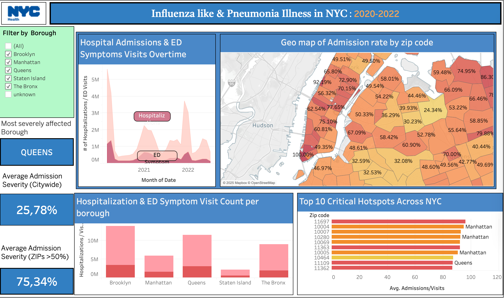

# Module 2 Final Project

<p align='center'>
An analysis of emergency department visits and hospital admissions in NYC, using Department of Health and Mental Hygiene (DOHMH) data from NYC Open Data. Specifically, this project focuses on emergency department visits related to influenza-like illness and/or pneumonia symptoms during 2020-2022.
</p>

## Directory

- [Stakeholder](#stakeholder)
   - [Project Scope](#project-scope)
      - [Data Processing](#data-processing)
         - [In-Depth Analysis](#analysis)
            - [Visualizations/Charts](#visualizations)
               - [Findings in the Data](#findings)
                  - [Recommendations](#recommendations)
                     - [Reflections / What's Next](#reflections)

## Stakeholder


<p align='center'>
The NYC Department of Health and Mental Hygiene, or DOHMH, is a government agency and one of the largest public health agencies in the world. They are entrusted with promoting public health by providing services like investigating disease spread, conducting health inspections, and setting up no-cost health clinics in neighborhoods where they are most needed.
</p>

<p align='center'>
If you would like to learn more about NYC DOHMH, you can visit their website, where they provide extensive information on the health services they offer.
</p>

- [Department of Health Homepage](https://www.nyc.gov/site/doh/index.page)

## Project Scope

### Group Members

- Thierno Barry
   - [Thierno's LinkedIn](https://www.linkedin.com/in/thierno-barry-333288284/)
- Rolando Mancilla-Rojas
   - [Rolando's LinkedIn](https://www.linkedin.com/in/rolandoma33/)

### Aims
<p align='center'> 
Project focus revolved around not only cleaning and analyzing the data, but also creating impactful visualizations for the NYC stakeholders being presented to.
Within the scope of the project, stakeholders at the Department of Health and Mental Hygiene (DOHMH) requested insights on the following questions:
</p>

1. What boroughs have the highest emergency department visits to hospital admissions ratio?
   - Specifically, regarding symptoms of influenza-like or pneumonia illnesses.

2. Which of these areas needs the most financial support?
   - Where should the DOHMH give more funding? Where should they give less?
  
<p align='center'>
With these questions in mind, it was also crucial for the data to be presented in an ethical way, since low-income neighborhoods were being examined to identify where allocated funding should go. This perspective was maintained throughout the project, given a strong commitment to supporting New York neighborhoods.
</p>

### Sources

- [NYC Open Dataset](https://opendata.cityofnewyork.us/)
- [Cleaned CSV](https://drive.google.com/file/d/1ByDEStAVRacADbbdEW0v1k2JspoiGVZr/view?usp=drive_link)
- [Modified ZCTA Code Tabulation Areas](https://nychealth.github.io/covid-maps/modzcta-geo/about.html)
- [Figma Project Board](https://www.figma.com/board/5VQh66Q7veSFcQa61Ak83B/M2---Stand-In---Stand-Down?node-id=30-543&t=9sVOFV8FFDlbiQKw-0)
- [Tableau Dashboard](https://public.tableau.com/app/profile/thierno.barry7757/viz/myprojectmoddashboard/Dashboard1?publish=yes)

## Data Processing

> [!NOTE]
> Capstone Project Expansion: Cleaning Pipeline. For notebook-level details, see [here](Notebooks/README.md).

<p align='center'>
A cleaning pipeline was created within the Jupyter notebook to enable quick, efficient cleaning of the raw dataset. Strong emphasis was placed on keeping the pipeline reproducible and easy to follow from raw source to final CSV output.
</p>

The cleaning pipeline followed these core steps:

1. Loaded and inspected the source file from NYC Open Data to verify field names, formats, and reporting ranges.
2. Checked for null values, duplicates, and formatting issues that could impact date-level and ZIP-level aggregation.
3. Standardized key fields, especially `date` and `mod_zcta`, so downstream grouping and joins would remain consistent.
4. Created a cleaned working dataset and then exported it as a final CSV for analysis and Tableau integration.
5. Validated the cleaned output against expected row counts and value ranges before using it in the dashboard.

<p align='center'>
This processing step allows for a strong foundation and helps avoid issues that could have affected admissions-to-visits ratios, borough mapping, and risk profiling later in the project.
</p>


## Analysis

<p align='center'>
On top of the usual cleaning, new columns were created to support chart creation in Tableau. To achieve this, several data type transformations were required.
</p> 

A simple `df['date'] = pd.to_datetime(df['date'])` and `df['mod_zcta'] = df['mod_zcta'].astype(str)` was used to convert dates to the `datetime` type. The `mod_zcta`, which represents the Modified ZIP Code Tabulation Area (ZCTA), was transformed to a string to prevent automatic changes to ZIP code values when passing the CSV to other tools.

<p align='center'>
Afterward, a new column, `Admissions/Visits`, was created to show the number of people hospitalized out of the number of people who visited an emergency department (ED) with symptoms of flu or pneumonia. This was calculated by dividing the admissions column by the visits column.
</p>

Next, a borough column was created to assign each ZIP code to its respective borough. To accomplish this, lists were defined to represent ZIP code ranges for each borough, using the [Modified ZCTA Code Tabulation Areas](https://nychealth.github.io/covid-maps/modzcta-geo/about.html) table.

```python
#matching the zipcode to the borough name
zipcodes ={
'Manhattan': list(range(10001, 10282)),
'The Bronx': list(range(10451, 10475)),
'Brooklyn': list(range(11201, 11256)),
"Queens": list(range(11004, 11110)) + list(range(11351, 11698)),
'Staten Island': list(range(10301, 10314))}

# creating a function to apply to the new column
def my_borough(zipcode):
    try:
        zip_int= int(zipcode)
    except: 
        return None
    for borough, zip in zipcodes.items():
         if zip_int in zip:
            return borough
    return 'unknown'
        
df['borough']=df['mod_zcta'].apply(my_borough) # apply function to the original data set
df_zip_date['borough']=df_zip_date['mod_zcta'].apply(my_borough) # apply function to the grouped data set
```
<p align='center'>
Next, an important step in quickly assessing which areas were high, moderate, or low risk was to evaluate the hospitalization rate, or `Admissions/Visits`. To do this, a method using `if` statements and inequality thresholds was applied to assign risk levels. Notably, only rates higher than the first quartile of ED visits were considered, since high rates with very low ED visit counts were treated as too insignificant and potentially skewing to the overall data.
</p>

```python
# assigning Risks profile ( low moderate high risks )
def assign_risk(admission_rate):
    if admission_rate['ili_pne_visits'] < 120:# first quartile of number of visit for ili/pne
        return "Low Volume _ Not Rated"
    elif admission_rate['admissions/visits']>50:
        return 'High risk'
    elif admission_rate['admissions/visits']>30:
        return 'Moderate risk'
    else :
        return 'Low risk'
df_zip_date['Risk_level']=df_zip_date.apply(assign_risk, axis=1) # created a column Risk level, useful if you need to know how severe is the admission rate for a specific zip code
```

> [!NOTE]
> Capstone Project Expansion: Statistical Testing. Full implementation details are documented in the [Statistical Testing Notebook](Notebooks/statistical-testing.ipynb).

<p align='center'>
Following feature engineering and risk profiling, statistical testing was performed as an extension to strengthen analytical validity. Assumption diagnostics were first evaluated, including distribution checks and Levene's test for variance equality. Since unequal variances were identified across borough groups, Welch's ANOVA was selected as the primary omnibus test due to its robustness under unequal variance and unequal sample size conditions.
</p>

If omnibus significance is detected, Games-Howell post-hoc comparisons are used to identify the specific borough pairs with statistically significant differences in mean hospitalization-related ratios. This addition supports a more defensible interpretation of borough rankings by combining descriptive insights with inferential evidence.

<p align='center'>
With these new columns created, charting and analysis of key insights could begin.
</p>

## Visualizations

<p align='center'>
The culmination of data manipulation came with the creation of visualizations, where the new columns made the process much easier. The main additional data type setup involved ZIP codes and boroughs, which were assigned when viewing the data source in Tableau. After geographic roles were assigned to both ZIP codes and boroughs, chart creation was focused on representing the central analysis outcome: Queens as the highest-risk borough for hospitalizations.
</p>



<p align='center'>
Notable moments here are the creation of the geomap using ZIP codes, the inclusion of KPIs to highlight key numbers, and the color alignment with NYC Health branding.
</p>


## Findings

<p align='center'>
As a result of the analysis, several key insights were revealed in the dataset. In an overall sense, Queens was identified as the most at-risk borough when it comes to hospitalizations from ED symptom visits. However, high-risk areas were also present in other boroughs.
</p>

In order, the top boroughs by hospitalization risk per ED symptom visit are:
1. Queens
2. Brooklyn
3. Manhattan
4. Bronx
5. Staten Island

<p align='center'>
Upon inspection of ZIP codes across all boroughs, Manhattan held many of the top 10 spots, with Queens as a notable runner-up. This was a less obvious finding that required deeper analysis. Manhattan, for example, had the highest hospitalization rates across all boroughs, but did not account for as many emergency department visits as other boroughs.
</p> 

## Recommendations

<p align='center'>
As a result of these findings, the original aims and questions were revisited:
</p>

1. Which borough had the highest rate of hospitalizations?
2. Which of these boroughs needs the most financial support?

<p align='center'>
Manhattan had the highest hospitalization rates, but Queens showed greater severity because it accounted for a far greater number of ED visits. Therefore, the strongest recommendation is to provide more financial support to Queens, followed by Manhattan. Upon further investigation into the ZIP codes with high hospitalization rates in Queens, those areas were found to be representative of lower-income, immigrant communities. These areas appear to be struggling the most and could benefit from additional support through no-cost health clinics provided by DOHMH.
</p>

<p align='center'>
Furthermore, the analysis reveals that, when accounting for the number of visits, Staten Island had the lowest hospitalization rates and was deemed a low-risk borough. Through outside sources, Staten Island is often regarded as one of the wealthiest boroughs in NYC. Speculatively, this outcome could be attributed to greater access to private healthcare in this borough, reducing the need for additional resources from DOHMH.
</p>

## Reflections


<p align='center'>
Given the limited time available for presentation, careful prioritization was needed for which insights to highlight. In doing so, emphasis was placed on a commitment to ethical data analysis and presentation. From an ethical analysis perspective, it was considered most important to showcase the challenges Queens faces as an underrepresented borough. Anecdotally, many of the top ZIP codes analyzed were in Corona, an area often associated with low-income, immigrant families. Given the relevance of this community context, representing these findings was treated as especially important.
</p>

<p align='center'>
Moving forward, continued emphasis is expected on highlighting underrepresented areas across the field in data analytics work.
</p>

***

> [!NOTE]
> This is a fictitious scenario created by the GitHub authors for academic purposes only.
